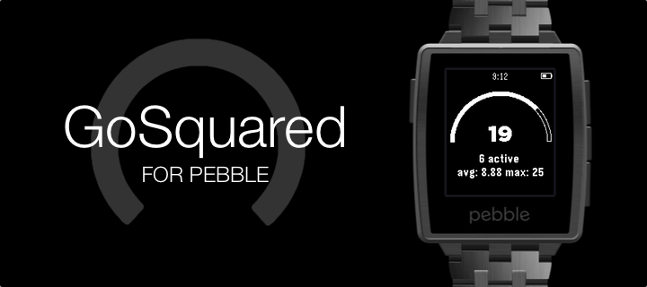

## GoSquared for Pebble

See GoSquared current visitors directly from your Pebble. See current and active visitors as well as 7 day average and highest.

You'll need your [GoSquared API key and site token](https://www.gosquared.com/integration).

<small>*GoSquared for Pebble is not affiliated with GoSquared.</small>

    

[MIT License](http://rmlewisuk.mit-license.org/)